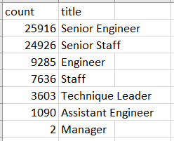
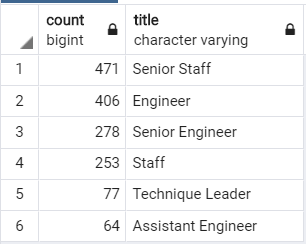
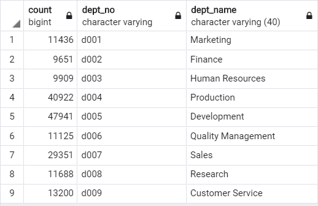
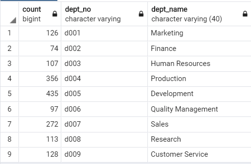

# Pewlett-Hackard Analysis

## Overview of Project

The Pewlett-Hackard company noticed that it had an aging population and wanted to ensure rising employees received adequate training and knowledge from more experienced employees before they retired.

### Purpose

The purpose of this project is to determine the number of retiring employees by their title and then identify employees who would be eligible to participate in a mentorship program.

## Resources

- Data Source: departments.csv, dept_emp.csv, dept_manager.csv, salaries.csv, titles.csv
- Software: PostgreSQL

## Results

- Results from a query written and executed to create a table that contains the number of titles filled by employees who are retiring shows that the majority of employees retiring are Senior Engineers, followed by Senior Staff, Engineers, Staff, Technique Leaders and then Managers.

  The counts of employees leaving for each position indicate where the company should focus its mentorship efforts.

   

- Within about the next 3 years, 72,458 employees will be eligible for retirement.
- Looking at the results from a query written and executed to identify the employees eligible for the mentorship program, we can see that 1,549 employees are eligible for mentorship, not nearly enough to fill all the roles eligible for retirement.
- As the table below reveals, a count of the mentorship-eligible employees by title shows that the majority of employees who are mentorship-eligible fall into the role of Senior Staff, Engineer, Senior Engineer, Staff, Technique Leader and then Assistant Engineer, respectively.
  
  

## Summary

- As the "silver tsunami" begins to make an impact, 72,458 roles will need to be filled. 
- As for whether there are enough qualified, retirement-ready employees in the departments to mentor the next generation of Pewlett-Hackard employees, the answer, based off our results, is yes. However, there are far more employees who are retirement-ready than mentorship-eligible which could pose a problem when the "silver tsunami" hits.
-  An additional query I ran, counting up the mentorship-eligible employees by title shows that the company will need more engineers to fill Senior Engineer positions as well as other roles listed in the company. One way the company might identify more individuals to fill the positions of retiring employees is to expand criteria of mentorship-eligible employees.
  
   Count of titles of mentorship-eligible employees:

    

    Count of titles of retirees:

    
-  After expanding the mentorship eligibility from those exclusively born in 1965 to those born between 1956 and 1965 (the birth date range of employees in our data) we can see that there are a lot more employees available to receive mentorship.
  If the company is worried about filling all the retiring roles, it should try and target the number of mentorship-eligible candidates to meet the need for after the "silver tsunami" hits. 
  
    I chose 1956 as the starting birth year because it falls after 1955, the year "retirement-ready" employees were born.
    
    Mentorship eligibility expanded birth years by department:
  

   Previous Mentorship eligibility (only those born in 1965) by department:
  